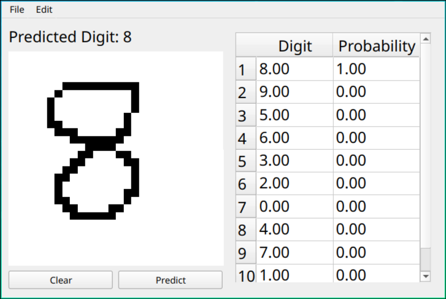

# number_recognition_gui

Python GUI machine learning program to recongise handwritten numbers.

Under the hood it uses a CNN (Convolutional Neural Network) trained on the MNIST number database.

# Demo

## Features

* Live Probabilites Mode - shows number probabilites when drawing
* Light/Dark Canvas Mode - purely useless asthetics

# Libraries Used

* Uses PyTorch for Machine Learning.
* PyQt6 for the GUI.
